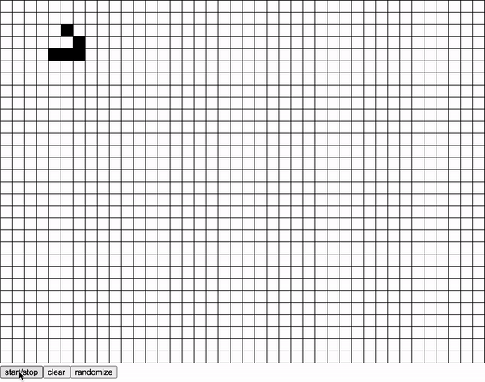

# John Conway's Game of Life

## Table of Contents

1. [Introduction](#introduction)
2. [Rules](#rules)
3. [Examples](#examples)
	* [Still Lifes](#still-lifes)
	* [Oscillators](#oscillators)
	* [Spaceships](#spaceships)
	* [Generators](#generators)
	* [Random](#random)
4. [How to use](#how-to-use)

	

## Introduction

John Conway's Game of Life is an example of cellular automata.
It simulates the life of cells.
The grid contains squares which either contain a live cell or a dead cell.
As time passes, cells either die or come alive according to specific rules.

## Rules

1. Any live cell with fewer than two live neighbours dies, as if by underpopulation.
2. Any live cell with two or three live neighbours lives on to the next generation.
3. Any live cell with more than three live neighbours dies, as if by overpopulation.
4. Any dead cell with exactly three live neighbours becomes a live cell, as if by reproduction.

## Examples

#### Still Lifes

These patterns stay constant indefinitely as time passes. An oscillating pattern is included to show that time is passing.

#### Oscillators

These patters repeat after a certain number of iterations. The period of each oscillator may vary.

#### Spaceships

These patterns repeat after a certain number of iterations but move a certain distance in each period. On the left is the Glider and on the right is the Light Weight Space Ship.

 

#### Generators

These patterns grow indefinitely by generating spaceships during each period.

#### Random

These patterns behave chaotically and either become destroyed or become one of the other forms

## How to Use

**Buttons**
* start/stop: starts and stops the simulation.
* clear: clears all live cells on the grid; results in an empty grid.
* randomize: randomizes cells on the grid with a 30:70 ratio of live and dead cells.

**Clicking**
* toggles the cell between dead and alive.
* a dead cell becomes a live and a live cell dies.

---

**Sources**

* [Wikipedia](https://en.wikipedia.org/wiki/Conway%27s_Game_of_Life)